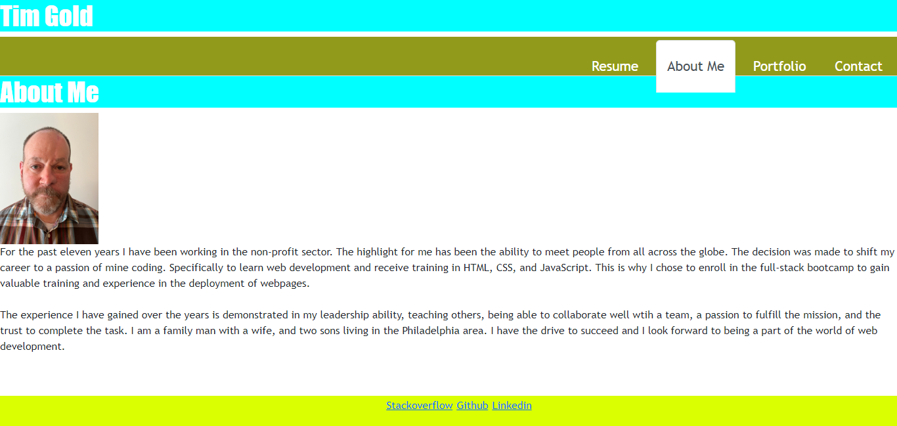

# react-portfolio-tg-app

## Description 
As I move through the full-stack web development bootcamp I wanted to create a react portfolio of my projects that I have worked on during the class. I want to have something crisp that highlights who I am, how to contact me, six of my projects showing a pattern of complexity and growth as well as working in groups. This portfolio will give me a place to update my work and show my progress and increased capabilities in web development. I am grateful all that I have learned in these various challenges and projects. 

## Installation 
Upon opening the application you will be taken to my about me page. There you can read a little bit more about me and see a recent photo. There are links to my resume, portfolio which highlights six projects, and a contact form to get in touch. In the footer section there are links to my linkedin, github, and stackoverflow.

## Usage 
Here is the link to the deployed application: https://tgold1.github.io/react-portfolio-tg-app/

## Credits 
N/A

## License
N/A

